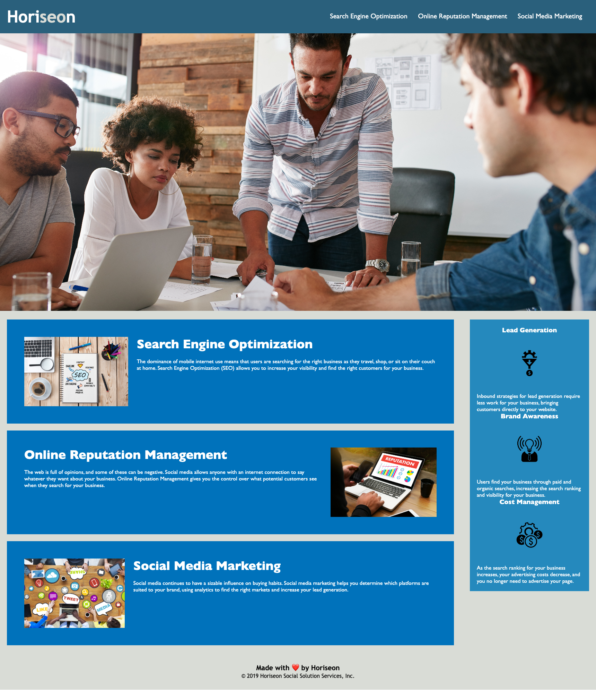

# UTA Module 1 Challenge
## This is my first on-the-job ticket challenge which allow me to have some exposure to a very important aspect of web development: accessibility.
## Things I have learned from this challenge:
- Making websites accessible to all users
- A website needs to be optimized for search engines.
-  Codes not only need to be functional but it also needs to be concise.
- What a semantic HTML should look like.
- HTML elements should follow a logical structure independent of styling and positioning.
## This is how the website looks like:

## Website link is included here:
[https://daisyle0203.github.io/uta_module1_challenge/](https://daisyle0203.github.io/uta_module1_challenge/)